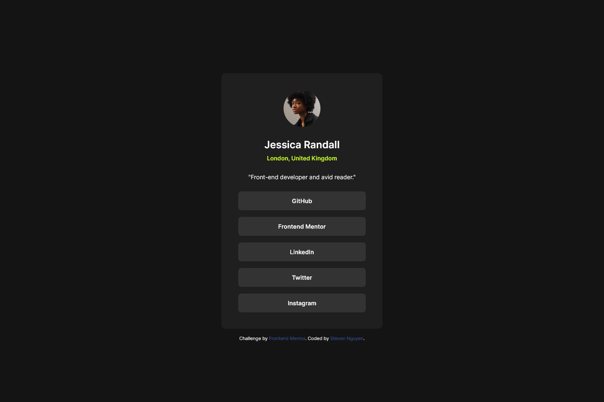

# Frontend Mentor - Social links profile solution

This is a solution to the [Social links profile challenge on Frontend Mentor](https://www.frontendmentor.io/challenges/social-links-profile-UG32l9m6dQ). Frontend Mentor challenges help you improve your coding skills by building realistic projects.

## Table of contents

- [Overview](#overview)
  - [The challenge](#the-challenge)
  - [Screenshots](#screenshot)
    - [Desktop Screenshot](#desktop-screenshot)
    - [Mobile Screenshot](#mobile-screenshot)
  - [Links](#links)
- [My process](#my-process)
  - [Built with](#built-with)
- [Author](#author)

## Overview

### The challenge

Users should be able to:

- See hover and focus states for all interactive elements on the page

## Screenshot

### Desktop Screenshot

### Mobile Screenshot

### Links

- Solution URL: https://github.com/snguyen56/social-links-profile-tailwind
- Live Site URL: https://snguyen56.github.io/social-links-profile-tailwind/

## My process

### Built with

- Semantic HTML5 markup
- Mobile-first workflow
- Utility-first workflow
- [React](https://reactjs.org/) - JS library
- [Vite](https://vitejs.dev/) - Build tool
- [Tailwind CSS](https://tailwindcss.com/) - For styles
- [Github Pages](https://pages.github.com/) - Hosting

## Author

- Website - https://snguyen56.github.io/
- Github - https://github.com/snguyen56
- LinkedIn - [Steven Nguyen](https://www.linkedin.com/in/steven-nguyen-bb5568216/)
- Frontend Mentor - [@snguyen56](https://www.frontendmentor.io/profile/snguyen56)
